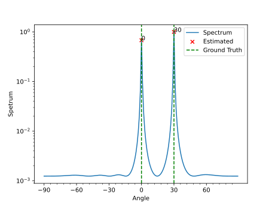

# Classical DOA

Classical DOA Estimation algorithms implemented in Python.

## Getting Started

### Installation

```bash
pip install classical_doa
```

or install from source

```bash
git clone https://github.com/zhiim/classical_doa.git
cd classical_doa
pip install .
```

### Usage

A sample example of DOA estimation using MUSIC algorithm.

```python
import numpy as np

from classical_doa import arrays, signals
from classical_doa.algorithm import music
from classical_doa.plot import plot_spatial_spectrum

# Create a 8-element ULA with 0.5m spacing
ula = arrays.UniformLinearArray(m=8, dd=0.5)
# Create a complex stochastic signal
source = signals.ComplexStochasticSignal(nsamples=1000, fre=3e8, fs=1e9)

# Simulate the received data
received_data = ula.received_signal(
    signal=source, snr=0, angle_incidence=np.array([0, 30]), unit="deg"
)

# Calculate the MUSIC spectrum
angle_grids = np.arange(-90, 90, 1)
spectrum = music(
    received_data=received_data,
    num_signal=2,
    array=ula,
    signal_fre=3e8,
    angle_grids=angle_grids,
    unit="deg",
)

# Plot the spatial spectrum
plot_spatial_spectrum(
    spectrum=spectrum,
    ground_truth=np.array([0, 30]),
    angle_grids=angle_grids,
    num_signal=2,
)
```

You will a get a figure like this:


Check `examples` for more examples.

## What's implemented

### Array Structures

- Uniform Linear Array (ULA)
- Uniform Rectangular Array (URA, to be implemented)
- Uniform Circular Array (UCA)

### Signal Models

- Narrowband  
   complex stochastic signal
- Broadband  
   chirp signal
  broadband signal consisting of multiple narrowband signals

### Algorithms

- ULA
  - [x] MUSIC
  - [x] ESPRIT
  - [x] Root-MUSIC
  - [x] OMP
  - [x] l1-SVD
- URA
  - [ ] URA-MUSIC
  - [ ] URA-ESPRIT
- UCA
  - [x] UCA-RB-MUSIC
  - [x] UCA-ESPRIT
- Broadband
  - [x] ISSM
  - [x] CSSM
  - [x] TOPS

## License

This project is licensed under the [MIT](LICENSE) License - see the LICENSE file for details.
